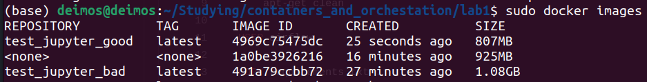

# Создание контейнера из "плохого" докерфайла:

`sudo docker build -t test_jupyter_bad -f Dockerfile_bad .`

`sudo docker run -d -p 8000:8000 test_jupyter_bad`

# Создание контейнера из "хорошего" докерфайла:

`sudo docker build -t test_jupyter_good -f Dockerfile_good .`

`sudo docker run -d -p 8000:8000 test_jupyter_good`

# Сравнение размеров образов.

`sudo docker images `



807 Мб у хорошего и 1080 Мб у плохого. И у хорошего тоже есть, куда расти.

# Bad practices при написании докерфайла.

## 1. Не указывать явно версии зависимостей.

Причина: в новых версиях зависимостей может не быть обратной совместимости со старыми версиями, с которыми раньше работал контейнер, кроме того, в новых версиях могут появляться баги или уязвимости.

Пример: `FROM jupyterhub/jupyterhub:latest`

Исправление: `FROM jupyterhub/jupyterhub:3.1.1`

## 2. Не оптимизировать использование слоев.

Причина: при выполнении команды RUN (и не только) создаются новые слои образа, и если параметры этой команды поменялись, то слой будет пересоздаваться. В таком случае, если совмещать в рамках одного слоя команды, которые изменяются редко и изменяются часто, редко измнеяющиеся команды будут каждый раз перевыполняться. Также, плохо не объединять родственные команды в одном слое, т.к. получится нагромождение слоев.

Пример:

```
# Не разделение команд на слои
RUN apt update && apt -y install python3-dev git \
    && pip install numpy pandas matplotlib scikit-learn
# Избыточное разделение
RUN apt update
RUN apt -y install python3-dev 
RUN apt -y install git

```

Исправление:

```

# Объединяем родственные команды в один слой, и редко меняющиеся команды выделяем в отдельные слои
RUN apt update \
    && apt -y install python3-dev git
RUN pip install --no-cache-dir \
    numpy==1.24.3 \
    pandas==2.1.4 \
    matplotlib==3.8.2 
```

## 3. Не очищать кэш.

Причина: сильно увеличивается размер образа из-за неиспользуемых файлов.

Пример: `RUN apt update && apt -y install python3-dev git`

Исправление: `RUN apt update && apt -y install python3-dev git && apt clean`

## 4. Копирование ненужных файлов.

Причина: увеличение размера образа, проблема с безопасностью

Пример: `COPY . .`

Исправление: `COPY my_file.txt .`

Также, желательно использовать .dockerignore файл на всякие node_modules, .git и т.д.

## 5. ENTRYPOINT/CMD не в формате JSON.

Причина: возможные проблемы с обработкой сигналов ОС.

Пример: `ENTRYPOINT jupyterhub --log-level=DEBUG`

Исправление: `ENTRYPOINT ["jupyterhub", "--log-level=DEBUG"]`

# Плохие практики по использованию контейнера.

### 1. Использование нескольких сервисов в одном контейнере.

Усложняется масштабирование, нарушается принцип изоляции сервисов друг от друга. Лучше разнести сервисы по отдельным контейнерам, а далее оркестрировать их работу.

### 2. Хранение данных в контейнере, а не в volume.

Контейнеры работают в режиме stateless, то есть при перезапуске/отключении все данные потеряются. Чтобы этого избежать, лучше сохранять важные данные через монтированный volume.

# Когда не стоит использовать контейнеры?

### 1. Монолитная архитектура приложения

Как правило, монолитные приложения занимают очень много места за счёт единой кодовой базы. При использовании контейнеризации, размер выходного образа будет слишком большим для эффективного использования. Кроме того приложение может критически пострадать от снижения производительности. Вдобавок, скорее всего, усложнится процесс разработки и доставки.

Контейнеризация может дать некоторые плюсы, например, упрощенный перенос на другую платформу, но описанные минусы сильно перевешивают их.

### 2. Критически зависимые от производительности приложения

Переход в контейнеры несколько снижает скорость работы системы/приложения, а также требует дополнительной памяти для движка (кроме lxc, lxc идёт вместе с линухой), файлов, образа. 

Просадки в производительности достаточно критичны, например, в edge-устройствах, таких как, робот-пылесос, или в системах, работающих в реальном времени.
