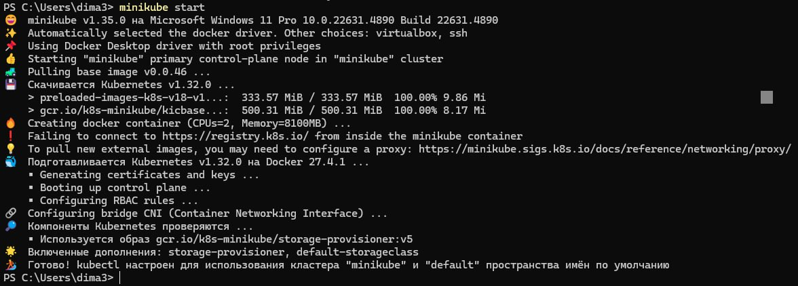

# Часть 1. Установка minikube

Проверяем установку:

Все работает, как нужно.

# Часть 2. Создание объектов через CLI

Создаем файлы манифестов, копируем туда нужный код, и запускаем (шаг 1-2):

Смотрим, что все поставилось, и смотрим описание сервиса (шаг 3):

Далее, создаем новый манифест, копируем туда нужный код, проверяем (Шаг 4):

Проверяем запуск пода (Шаг 5):

# Часть 3. Подключение извне

Перенаправляем порты (Шаг 1):

Запускаем сервис, проверяем, что открылась вкладка NextCloud (шаг 2). Сервис открылся)

Устанавливаем доп. компонент dashboard (шаг 3), открываем его в вебе:

# Задание

* Перенесли POSTGRES_USER и POSTGRES_PASSWORD из configmap (pg_config,ap.yml) в новый созданный манифест (pg_secrets.yml).
* Перенесли переменные из манифеста deployment/nextcloud (раздел .env) в манифест nextcloud-configmap (в том же файле nextcloud.yml).

  
* Добавляем пробы liveness и readiness в манифест deployment/nextcloud (файл nextcloud.yml). Проверка в вебе пода:

  

# Ответы на доп. вопросы

### Вопрос 1.

**Важен ли порядок выполнения этих манифестов? Почему?**

Да, важен, т.к. некоторые ресурсы ссылаются на другие (манифест deployment/postgres ссылается на манифест postgres-configmap).

### Вопрос 2.

**Вопрос: что (и почему) произойдет, если отскейлить количество реплик postgres-deployment в 0, затем обратно в 1, после чего попробовать снова зайти на Nextcloud?**

~~Когда количество реплик станет 0, то БД окажется недоступной, и nextcloud потеряет соединение с БД. После возвращения количества реплик до 1, БД снова поднимется, но соединение в nextcloud само не восстановится, и вылетит ошибка.~~

В манифестах postgres и nextcloud не прописаны никакие persistent volume, поэтому, при изменении количества реплик в 0, единственный под постгреса удалится, а вместе с ним и все данные БД. После возвращения количества реплик в 1, поднимется новый под постгреса. Если постучаться, когда пода нет или он только стартует, то выпадет ошибка, что нет подключения к БД. Если постучаться в БД, когда под поднят и соединение восстановлено, то БД окажется пустой, и nexcloud заново инициализирует БД нужными значениями - подключение пройдёт, но все прошлые данные уже потеряны, поэтому придется начать "с чистого листа").

Таким образом: после восстановления подключения к постгресу, nextcloud обнаружит там пустую БД из-за потерянных данных, в результате чего начнется процесс инициализации БД, а все прошлые данные будут потеряны.
