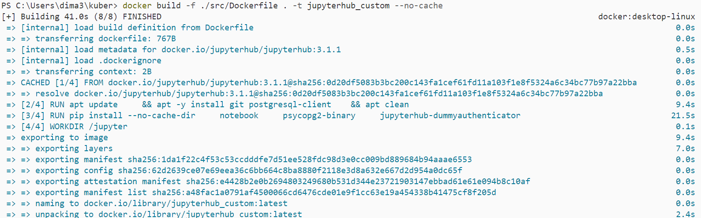
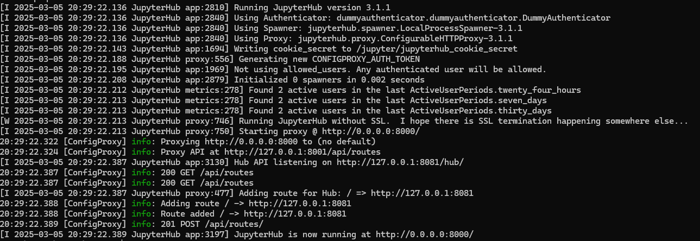
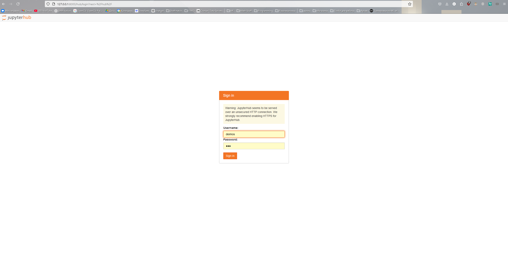
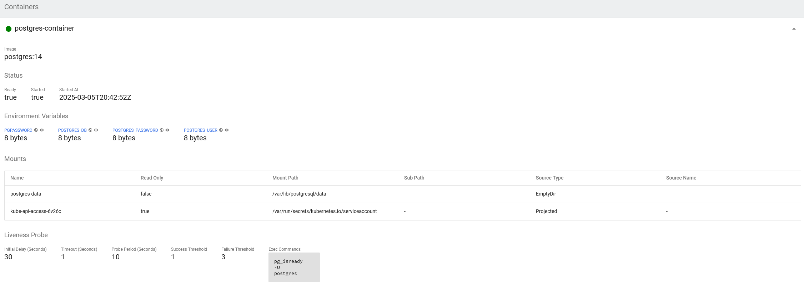

# Собираем кастомный образ

`docker build -f ./src/Dockerfile . -t jupyterhub `

Отправляем его в minikube:

`minikube image load jupyterhub_custom:latest`

# Настройка minikube

Применяем манифесты

`kubectl create -f jupyterhub.yml`

`kubectl create -f postgresql.yml`

Проверяем

`kubectl logs deployment/jupyterhub`

Заходит в jupyterhub извне:

`kubectl port-forward service/jupyterhub-service 8000:8000`

# Инфраструктура

## Postgres

* ConfigMap, с переменной названия БД
* Secrets, с переменными для подключения к БД
* Service
* Deployment
* init-container
* livenessProbe

  

## Jupyterhub

* Secrets, с начальным скриптом инициализации
* Service
* Deployment
